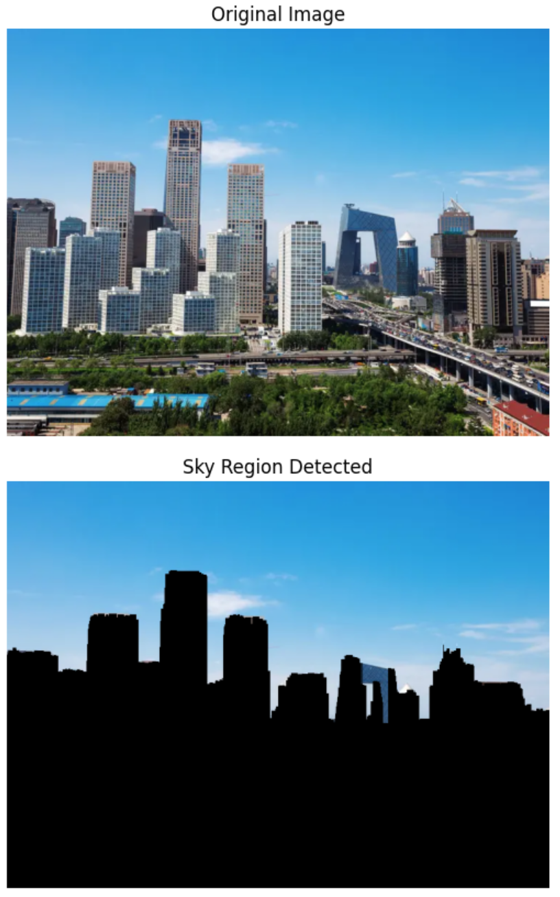
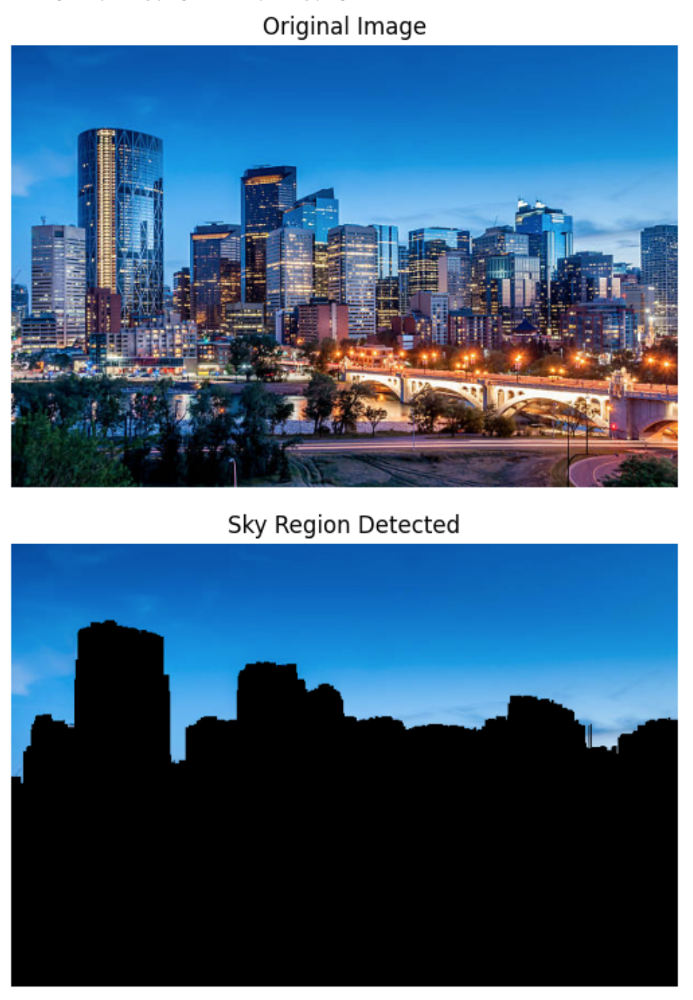
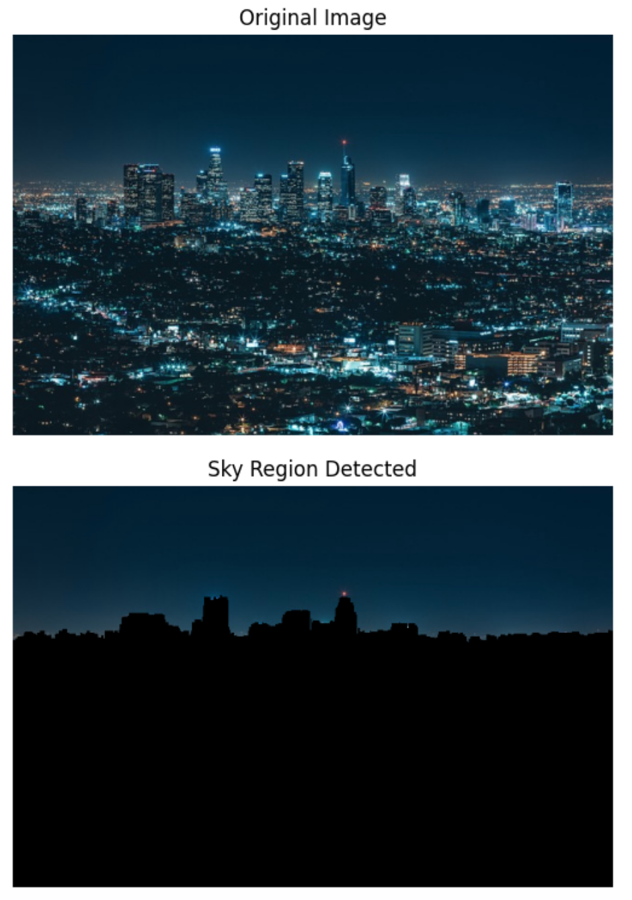

# Sky Detection Application

## Overview
This application uses some basic computer vision techniques to identify and isolate the sky in images. It's built using Python and leverages libraries like OpenCV for image processing and Gradio for creating an interactive web interface.

## Usage
The app is deployed with a Gradio interface, accessible through [Sky Identification](https://huggingface.co/spaces/xuyanran000/sky_identification) that allows for easy testing and interaction. Users can upload an image through the web interface, and the application will process the image to highlight the sky region.

## Demo Pictures

